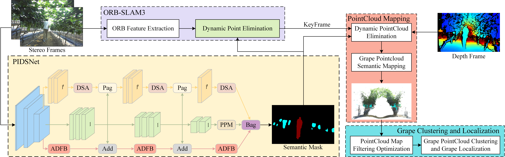
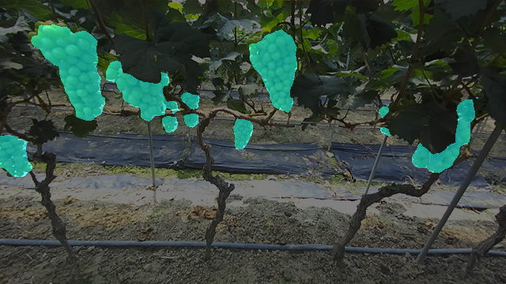
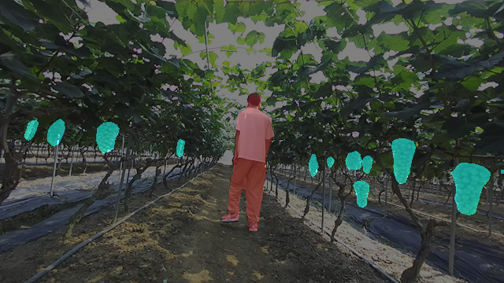
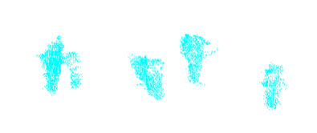
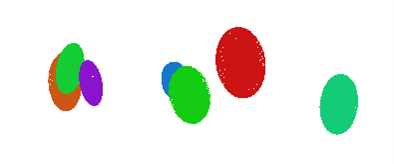

# A Real-Time Semantic 3D Vineyard Mapping and Fruit Localization System for Yield Estimation in Dynamic Vineyards

This is a real-time and robust system for 3D mapping and fruit localization in dynamic vineyard environments. It combines the ORB-SLAM3 framework with a lightweight semantic segmentation network (EFSegNet), dynamic feature filtering, point cloud optimization, and ellipsoid-based grape bunch localization.

---

## 🧠 Network Architecture

**Pipeline**  

**EFSegNet Semantic Segmentation Structure**  

---

## 🔧 Features

- 🧠 **EFSegNet**: A lightweight segmentation network with attention-based enhancements.
- 🧹 **Dynamic Object Filtering**: Removes pedestrians and moving elements to stabilize SLAM.
- 🌐 **3D Semantic Mapping**: Embeds fruit information into point clouds.
- 🍇 **3D Grape Localization**: Uses DBSCAN and PCA for ellipsoid modeling.
- 🚀 **Real-Time Execution**: 23.1 FPS on standard GPU hardware.

---

## 📷 Visual Results

### 🔍 Semantic Segmentation
EFSegNet accurately segments grape bunches and pedestrians in complex vineyard scenes.

**Static Scene**  

**Dynamic Scene**  

---

### 🗺️ 3D Mapping

**Original SLAM Mapping**  

**Semantic-Enhanced Mapping**  

---

### 🍇 Fruit Localization and Clustering

**Extracted Grape Point Clouds**  

**Clustered & Fitted with Ellipsoids**  

---

## 🧪 Experimental Setup

The mobile platform is equipped with:
- ZED2 stereo camera
- Robosense Helios 32 LiDAR (for ground truth)
- Intel i5-12500H + NVIDIA RTX 3060
- Ubuntu 20.04 with PyTorch + ROS

---

## 📦 Dataset Download

We provide the dataset used in our experiments for reproducibility and further research.

- 📁 **Dataset Download (Baidu Netdisk)**  
  🔗 [https://pan.baidu.com/s/1spMpWn3_jbq4pOYelJ1kVw?pwd=1234](https://pan.baidu.com/s/1spMpWn3_jbq4pOYelJ1kVw?pwd=1234)  
  🔑 **Extraction Code**: `1234`  
> ⚠️ If you use the dataset, please cite our paper accordingly.

---

## 📊 Performance Summary

| Metric                        | Value                     |
|------------------------------|---------------------------|
| Semantic mIoU                | 89.45%                    |
| 3D Localization Error        | 21.02 mm (avg)            |
| Bunch Counting Error         | 5.7% (single-row)         |
| System Speed                 | 23.1 FPS                  |
